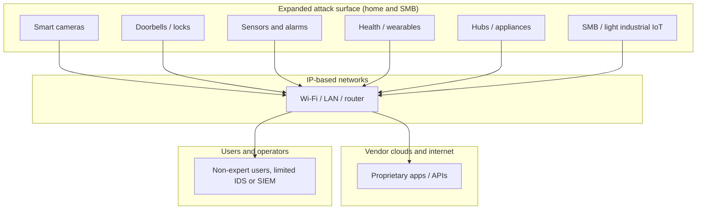
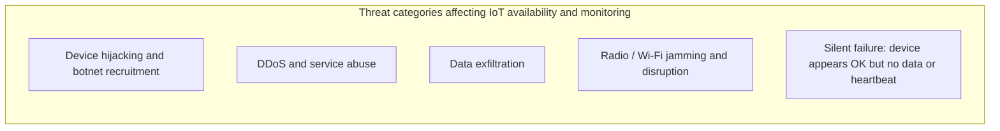

# Figures for Sections 4.1 and 4.2 (split)

Two separate figures — use **Figure 4.1** in §4.1 and **Figure 4.2** in §4.2.

---

## Figure 4.1 — Expansion of the digital attack surface

**Caption (use under the figure in Word):** *Figure 4.1: Expansion of the digital attack surface as IoT devices multiply in home and SMB environments.*

### Option A — Mermaid ([mermaid.live](https://mermaid.live))

1. Open [mermaid.live](https://mermaid.live).
2. Paste the code below → **Export** → PNG or SVG.
3. Insert into Word with the caption above.

### Option B — SVG

Insert **`FIGURE_4_1_attack_surface.svg`** (this folder) into Word.

---

## Figure 4.2 — IoT-specific threat categories

**Caption (use under the figure in Word):** *Figure 4.2: IoT-specific threat categories relevant to availability and monitoring.*

### Option A — Mermaid

### Option B — SVG

Insert **`FIGURE_4_2_threat_categories.svg`** (this folder) into Word.

---

## How to reference in the report

In **§4.1**, after the paragraph on growth of IoT:

*Figure 4.1 illustrates how heterogeneous devices connect through common network layers, enlarging the aggregate attack surface in home and SMB contexts.*

In **§4.2**:

*Figure 4.2 summarises threat categories discussed below, including deliberate disruption and silent failure scenarios that undermine availability-based security.*

---

## Other report assets in this folder

| File | Use |
|------|-----|
| `FIGURE_4_1_attack_surface.svg` | Figure 4.1 |
| `FIGURE_4_2_threat_categories.svg` | Figure 4.2 |
| `FIGURE_4_1_4_2_threat_landscape.md` | Mermaid + captions for 4.1 / 4.2 |
| `TABLE_5_6_research_gap_comparison.md` / `.html` | Research-gap — **Table 1** at **Ch.7 §7.6** |
| `TABLE_6_traceability_matrix.md` / `.html` | Legacy (do not use without full renumber) |
| `TABLE_8_traceability_USER_TOC.html` | **Tables 2–4** for **Ch.8 §8.6** (after **Table 1** at §7.6) |
| `REPORT_VISUALS_PLACEMENT.md` | **Master list**: Figures 3–11 + Table 5 placement |
| `FIGURE_3_system_architecture.svg` … `FIGURE_10_performance_sketch.svg` | Architecture, heartbeat, data model, module map, dashboard wireframe, performance sketch |
| `FIGURE_OPTIONAL_STRIDE_lite.svg` | Optional STRIDE-style figure for Ch.6 |
| `REPORT_DIAGRAMS_MERMAID.md` | Mermaid → PNG: anomaly, escalation, ER, roadmap |
| `TABLE_5_test_cases.html` / `.md` | **Table 5** for Ch.11 |
| `TABLE_7_traceability_USER_TOC.html` | Stub only — points to `TABLE_8_traceability_USER_TOC.html` |
| `DISSERTATION_PLACEMENT_AND_FIXES.md` | Where figures/tables go + chapter cross-reference fixes |
| `HOW_TO_BUILD_ALL_REPORT_VISUALS.md` | Steps for further figures |
