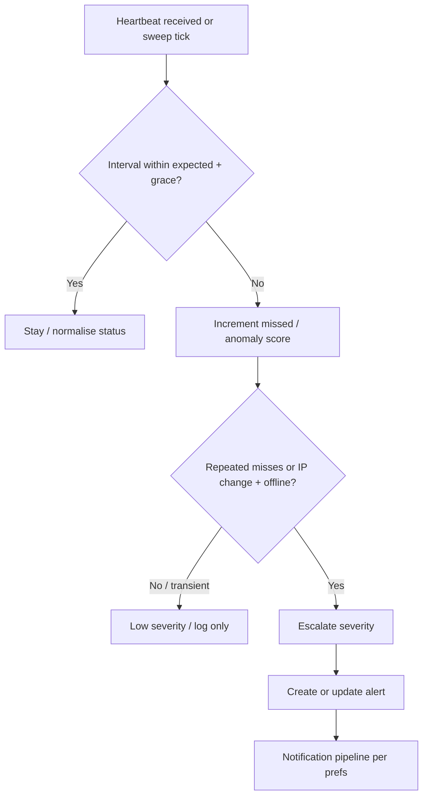
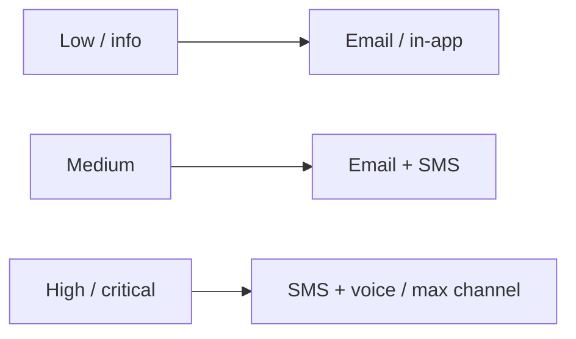
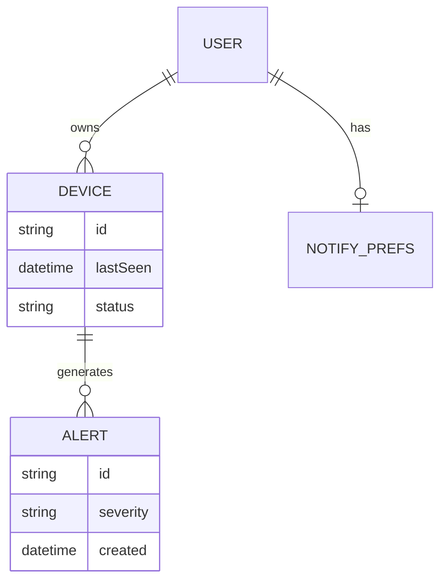
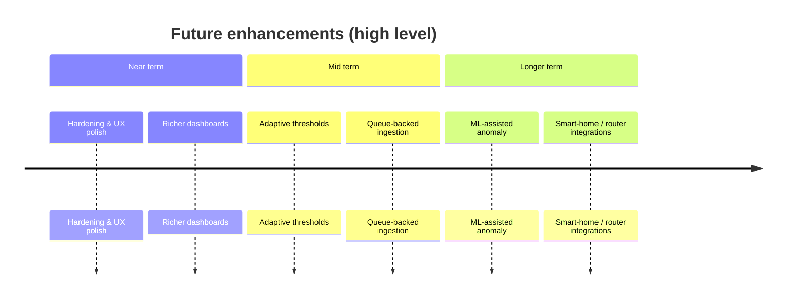
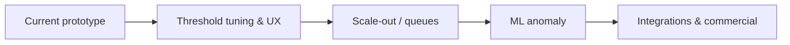
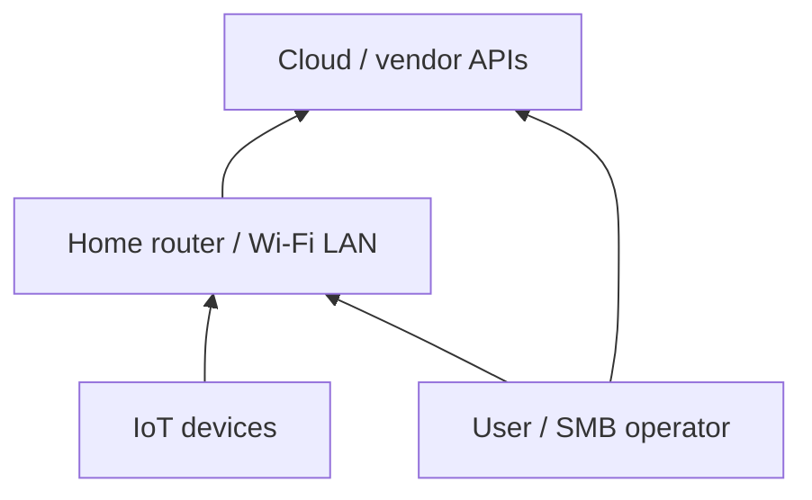

# Mermaid diagrams for the dissertation

Copy a fenced block into [Mermaid Live Editor](https://mermaid.live), export **PNG** (high resolution if needed), insert in Word with caption.

**Placement** — see `REPORT_VISUALS_PLACEMENT.md` (Figures 5, 6, 7 alternative, 11).

---

## Figure 5 — Anomaly decision flow (Ch.9 §9.6)

---

## Figure 6 — Notification escalation (Ch.9 §9.7)

---

## Figure 7 — Data relationships (alternative to SVG; Ch.9 §9.8 or Ch.10 §10.4)

*(ER syntax is illustrative; MongoDB is document-oriented — mention that in caption.)*

---

## Figure 11 — Future-work roadmap (Ch.13)

*(If `timeline` fails in your Mermaid version, use the flowchart below.)*

---

## Optional — layered threat (device → network → cloud → user)

Use in **Ch.6** only if you want another schematic beyond Figures 1–2.
